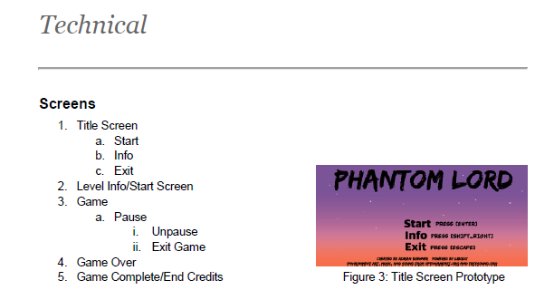
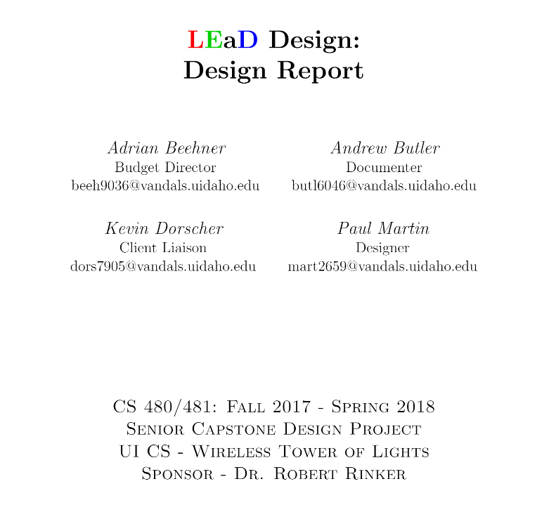
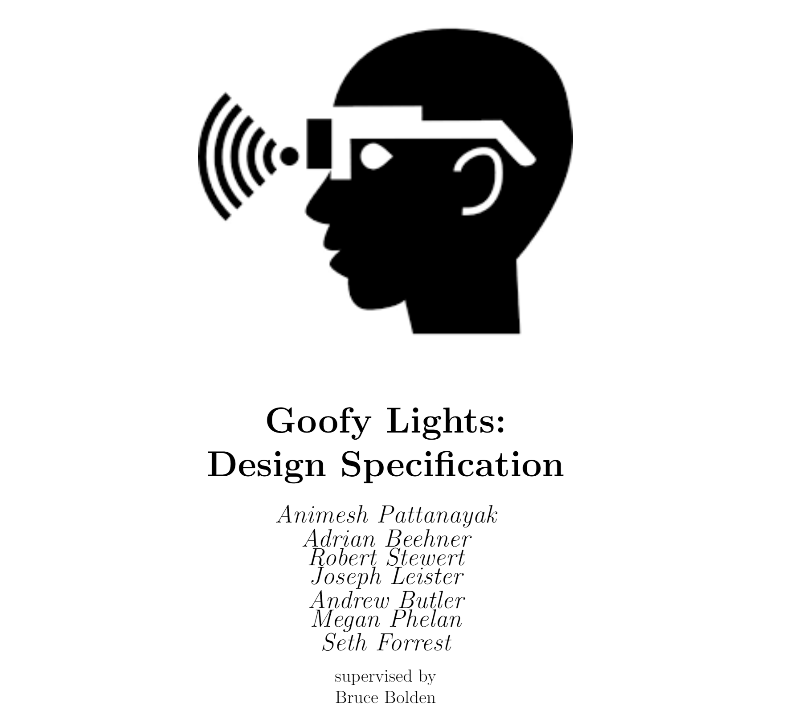
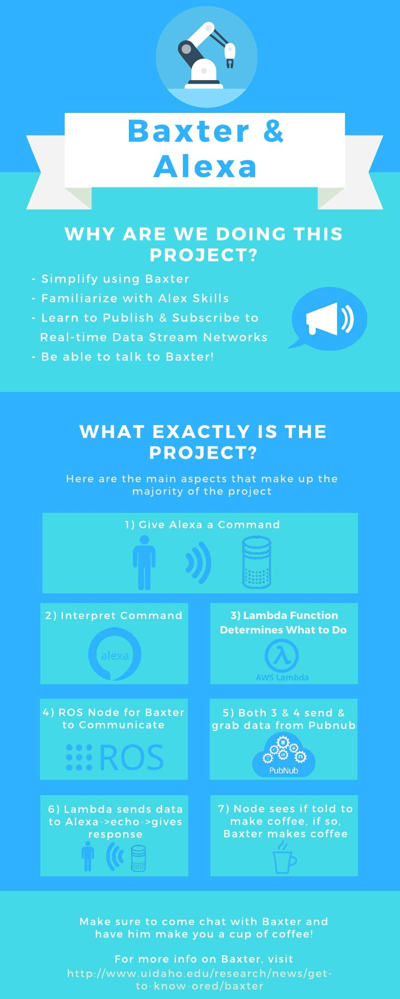
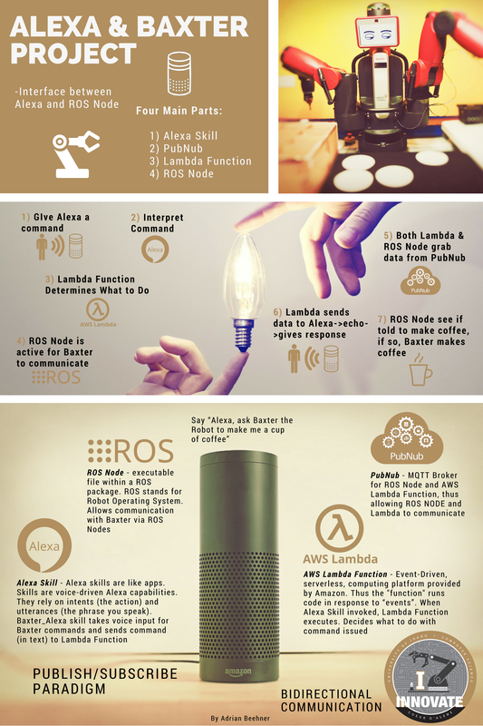
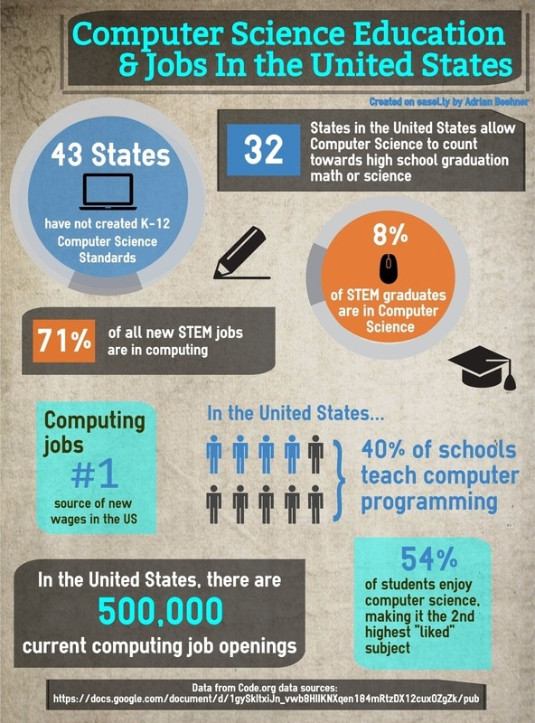
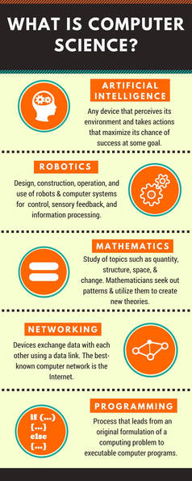

# Graphics and Technical Writings

## Design Specifications

### Game Design Specification - Phantom Lord

**Description:** The Design Specification in relation to the `Java libGDX - Phantom Lord Video Game` Project from the [Projects Page](https://timetopretend54.github.io/MyPortfolio/navigation/projects/).

     
    <i><a href="../../assets/techwritings/Game_Design_Document.pdf">view full pdf</a></i>

### Design Specification - LEaD Design

**Description:** The Design Specification in relation to the `Custom PCB & Arduino Development - Wireless Tower of Lights` Project from the [Projects Page](https://timetopretend54.github.io/MyPortfolio/navigation/projects/).

     
    <i><a href="../../assets/techwritings/Design_Specification_LEaD_Design.pdf">view full pdf</a></i>

### Design Specification - GoofyGlasses

**Description:** The Design Specification in relation to the `Java Animation Editor - GoofyGlasses` Project from the [Projects Page](https://timetopretend54.github.io/MyPortfolio/navigation/projects/).

     
    <i><a href="../../assets/techwritings/Design_Specification_LEaD_GoofyGlasses_Software.pdf">view full pdf</a></i>

## Infographics

### Baxter-Alexa Interface

**Description:** Infographic for explaining the correlation to the goal of having Baxter (robot) and Alexa having bidirectional communication between each other.

    

### Baxter-Alexa Poster

**Description:** Infographic for showing off the various projects that have been done with Robotics at University of Idaho.

    

### CS Jobs Infographic

**Description:** For Techincal writing course.

    

### What is Computer Science Infographic

**Description:** For Techincal writing course.

    

