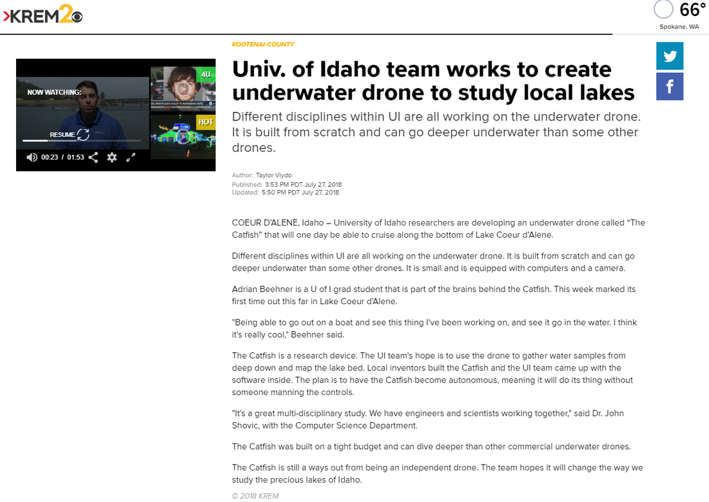
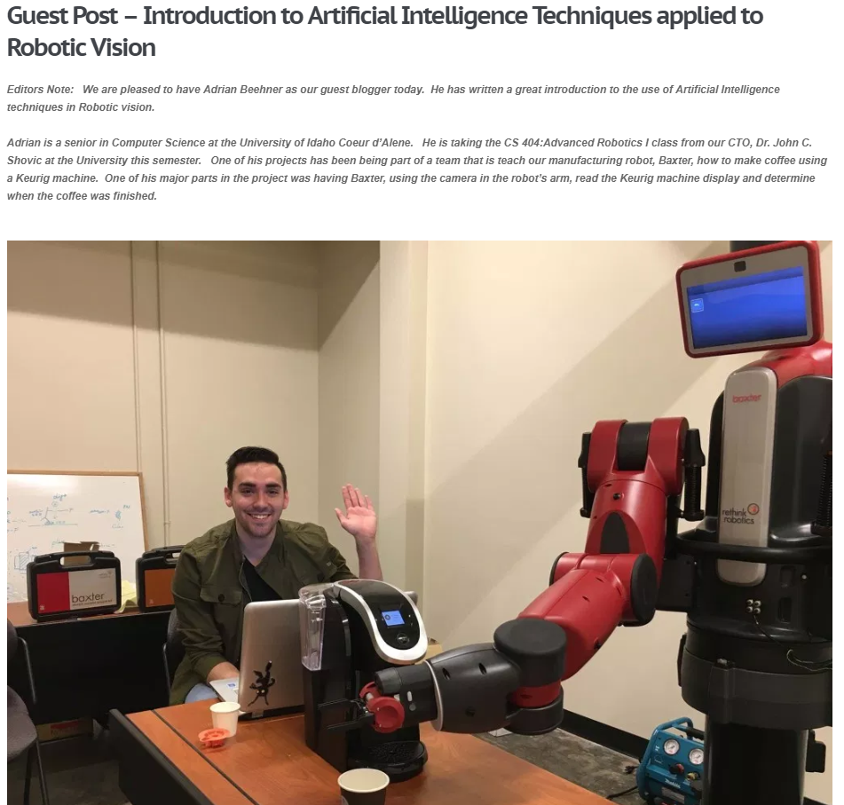
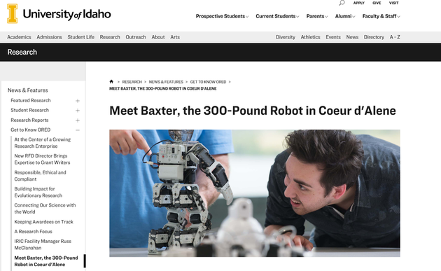

# Media

## Krem2 - Univ. of Idaho team works to create underwater drone to study local lakes

**Excerpt:** "COEUR D’ALENE, Idaho – University of Idaho researchers are developing an underwater drone called “The Catfish” that will one day be able to cruise along the bottom of Lake Coeur d’Alene."...

     
    <i><a href="https://www.krem.com/article/news/local/kootenai-county/univ-of-idaho-team-works-to-create-underwater-drone-to-study-local-lakes/293-578119295">view full article</a></i>

## Guest Post – Artificial Intelligence Techniques applied to Robotic Vision

**Excerpt:** "Editors Note:   We are pleased to have Adrian Beehner as our guest blogger today.  He has written a great introduction to the use of Artificial Intelligence techniques in Robotic vision"...

     
    <i><a href="https://www.switchdoc.com/2017/11/guest-post-ai-techniques-applied-to-robotic-vision/">view full article</a></i>

## Meet Baxter, the 300-Pound Robot in Coeur d'Alene

**Excerpt:** "Baxter does his best to teach the basics of robotics and artificial intelligence to the students at the University of Idaho Coeur d’Alene Computer Science Department. He’s even learning to make them coffee"...

     
    <i><a href="https://www.uidaho.edu/research/news/get-to-know-ored/baxter">view full article</a></i>

