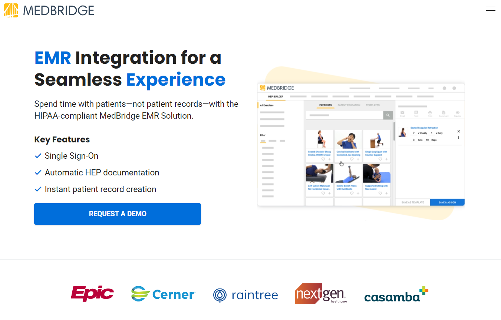
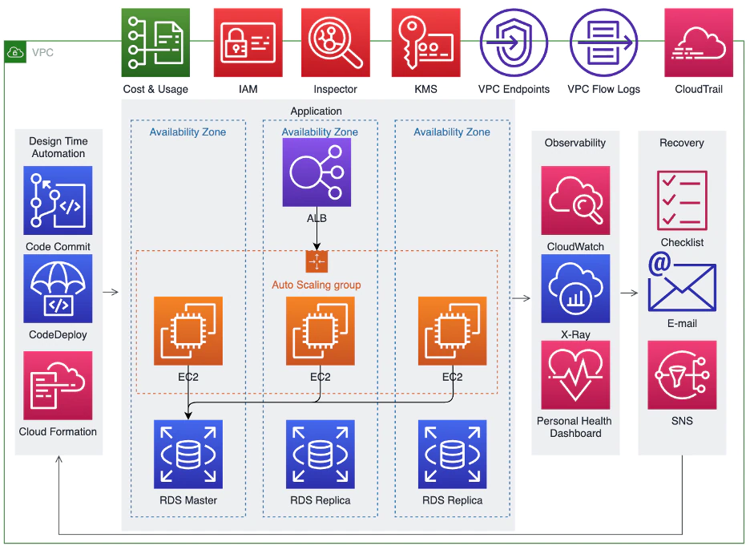
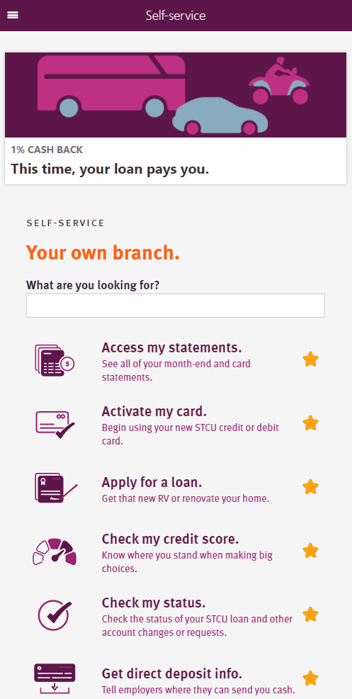
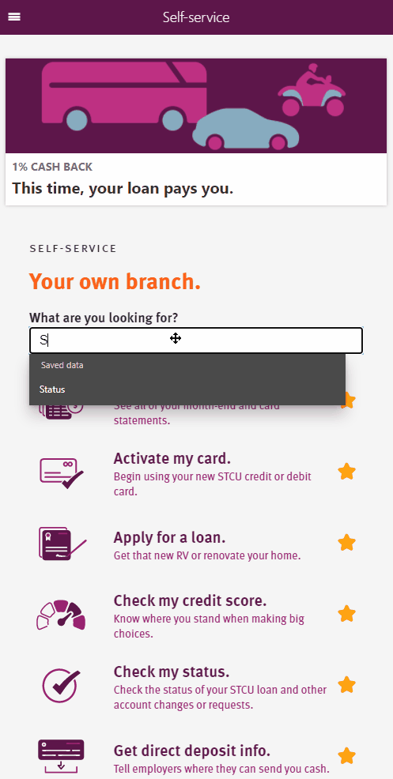
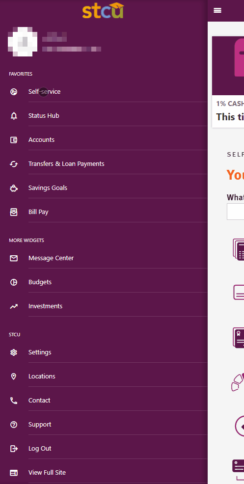
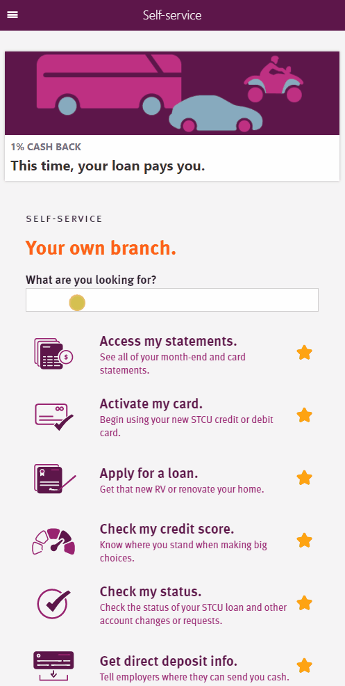
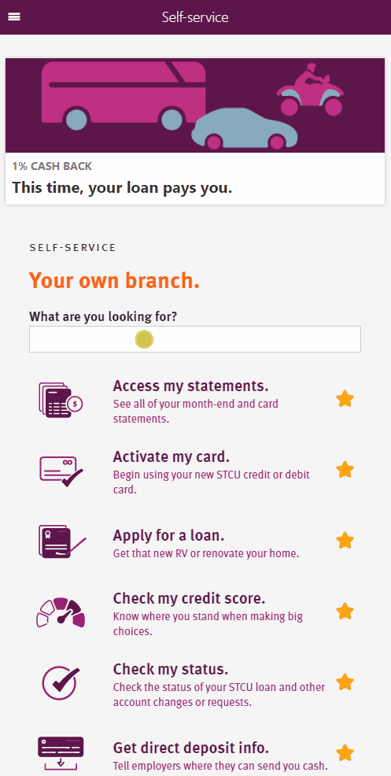

# Company Projects - Public

## MedBridge - [Website](https://www.medbridge.com/)

> Online education and digital patient care for healthcare professionals and organizations across the care continuum.

### EMR Integrations
[EMR Integration for a Seamless Experience](https://www.medbridge.com/enterprise/emr-integration/)

    

    <iframe 
        width="70%"
        height="327vh"
        src="https://www.youtube.com/embed/XK6gLAm7vo8?si=zgS91J0rLvbX6iZN"
        title="YouTube video player" 
        frameborder="0" 
        allow="accelerometer; autoplay; clipboard-write; encrypted-media; gyroscope; picture-in-picture" 
        allowfullscreen>
    </iframe>

**Role:** Contributed to engineering seamless provider and patient data EMR (Electronic Medical Record) integrations across diverse healthcare systems, using SSO solutions for secure, compliant data exchange. Including EPIC Direct and MyChart.

**Integration Examples:**

 [Medbridge - What is a MyChart Integration?](https://support.medbridge.com/hc/en-us/articles/31361472539411-What-is-a-MyChart-Integration)

[Medbridge - What is an Epic Direct Integration?](https://support.medbridge.com/hc/en-us/articles/27332462428179-What-is-an-Epic-Direct-Integration)

**Description:** 
>Learn more about MedBridge's Integrations: https://www.medbridge.com/enterprise/emr-integration/
 
 
Spend time with patients—not patient records—with the HIPAA-compliant MedBridge EMR Solution.

References:
- [https://www.medbridge.com/enterprise/emr-integration/](https://www.medbridge.com/enterprise/emr-integration/)
- [https://support.medbridge.com/hc/en-us/articles/31361472539411-What-is-a-MyChart-Integration](https://support.medbridge.com/hc/en-us/articles/31361472539411-What-is-a-MyChart-Integration)
- [https://support.medbridge.com/hc/en-us/articles/27332462428179-What-is-an-Epic-Direct-Integration](https://support.medbridge.com/hc/en-us/articles/27332462428179-What-is-an-Epic-Direct-Integration)
- [https://www.youtube.com/watch?v=XK6gLAm7vo8&ab_channel=MedBridge](https://www.youtube.com/watch?v=XK6gLAm7vo8&ab_channel=MedBridge)

## Capital One - [Website](https://www.capitalone.com/)

> At Capital One, we're changing banking for good. We were founded on the belief that no one should be locked out of the financial system.

### Site Reliability Engineering

[The 3 R’s of SREs: resiliency, recovery & reliability](https://www.capitalone.com/tech/software-engineering/sres-architecting-with-resiliency-recovery-reliability/)

    

**Role:** Monitored, measured, developed, and reported on the performance and reliability of systems using SLOs, ensuring adherence to established targets.

**Description:** 
>Learn more about CapitalOne's Site Reliability Engineering: https://www.capitalone.com/tech/software-engineering/sres-architecting-with-resiliency-recovery-reliability/
 
 
The 3 R’s of SREs: resiliency, recovery & reliability:
Using the 3 R’s as a lens to architect reliable applications

- Reference: [https://www.capitalone.com/tech/software-engineering/sres-architecting-with-resiliency-recovery-reliability/](https://www.capitalone.com/tech/software-engineering/sres-architecting-with-resiliency-recovery-reliability/)

## HCL America Inc. (Subsidiary of HCL Technologies - [Website](https://www.hcltech.com/))

### "**HCL SoFy**" - [Website](https://hclsofy.com/home)
Cloud-based software deployment solution/software.

>HCL SoFy is a cloud-based software deployment solution that deploys software packages. Can deploy HCL Software products to any cloud – public, private, or hybrid. SoFy uses Helm technology to combine HCL Products with common services into portable solutions across all Kubernetes environments.

- Reference: [https://www.hcltechsw.com/sofy](https://www.hcltechsw.com/sofy)

### "**HCL SoFy 2.0 Release**"

    <iframe 
        width="70%"
        height="327vh"
        src="https://www.youtube.com/embed/_yA0N1yWy8M"
        title="YouTube video player" 
        frameborder="0" 
        allow="accelerometer; autoplay; clipboard-write; encrypted-media; gyroscope; picture-in-picture" 
        allowfullscreen>
    </iframe>

**Role:** Lead the UI Team for the relaunch/new release of the SoFy 2.0 UI functionality (as mentioned in the video above).

**Description:** 
>Learn more about HCL SoFy: https://hclsw.co/sofy-home
 
 
HCL SoFy 2.0 is expanding the value for HCL Business Partners by introducing new capabilities to help grow your business. 

- Reference: [https://www.youtube.com/watch?v=_yA0N1yWy8M&ab_channel=HCLSoftware](https://www.youtube.com/watch?v=_yA0N1yWy8M&ab_channel=HCLSoftware)

### "**HCL SoFy 'Launch It!' Release**"

    <iframe 
        width="70%"
        height="327vh"
        src="https://www.youtube.com/embed/Ut328BmPFZw" 
        title="YouTube video player" 
        frameborder="0" 
        allow="accelerometer; autoplay; clipboard-write; encrypted-media; gyroscope; picture-in-picture" 
        allowfullscreen>
    </iframe>

**Role:** Lead the UI Team for the relaunch/new release of the `Launch It!` functionality (as mentioned in the video above).

**Description:** 
> Learn more about HCL SoFy: https://hclsw.co/sofy-home
 
 
This video provides a quick walk-through of how to launch a sandbox in HCL SoFy.

- Reference: [https://www.youtube.com/watch?v=Ut328BmPFZw&ab_channel=HCLSoftware](https://www.youtube.com/watch?v=Ut328BmPFZw&ab_channel=HCLSoftware)

## Spokane Teacher's Credit Union (STCU) - [Website](https://stcu.org/)

### **"Check my status"** - Event Platform App & System

     
    <i><a href="../../assets/projects/CompanyProjects/STCU/CheckMyStatus.gif">view full size</a></i>

**Role:** Contributed to development alongside team of developers.

**Description:** Web application that interacts/communicates w/ multiple systems. The system allows both customers/employees to get quick updates/information on a member's latest events, mark items are read, and provide alerts.

### **"Change statement settings"** - Member Notification Settings App

     
    <i><a href="../../assets/projects/CompanyProjects/STCU/ChangeStatementSettings.gif">view full size</a></i>

**Role:** Contributed to development alongside team of developers.

**Description:** Web application that lets member's change their monthly statements settings based on their Credit Card, Mortgage information. The application utilizes SMS verification for text based notification verification, as well as allowing email notifications.

### **"Self-Service"** - Member Service/Navigation App

     
    <i><a href="../../assets/projects/CompanyProjects/STCU/Self-Service.gif">view full size</a></i>

**Role:** Contributed to development alongside team of developers.

**Description:** Web application lets member's favorite their most used and liked STCU services, allowing for customization and ease of use. The application also provides a fuzzy search for the member, to quickly navigate/find their desired service.

<!-- ### **"Transfer card balances"** - Member Credit/Debit Transfer App

     
    <i><a href="../../assets/projects/CompanyProjects/STCU/TransferCardBalances.gif">view full size</a></i>

**Role:** Contributed to development alongside team of developers.

**Description:** Web application lets member's transfer card balances from an external institution to STCU. The application keeps a history of member's previous transfers, checks/validates the address/acct info of the external balance owed.

### **"Set my PIN"** - Member Card PIN Change App

     
    <i><a href="../../assets/projects/CompanyProjects/STCU/SetMyPIN.gif">view full size</a></i>

**Role:** Contributed to development alongside team of developers.

**Description:** Web application lets member's change their desired card's PIN (following security standard/guidelines), and communicates directly w/ STCU's other application `Activate my card`. -->

