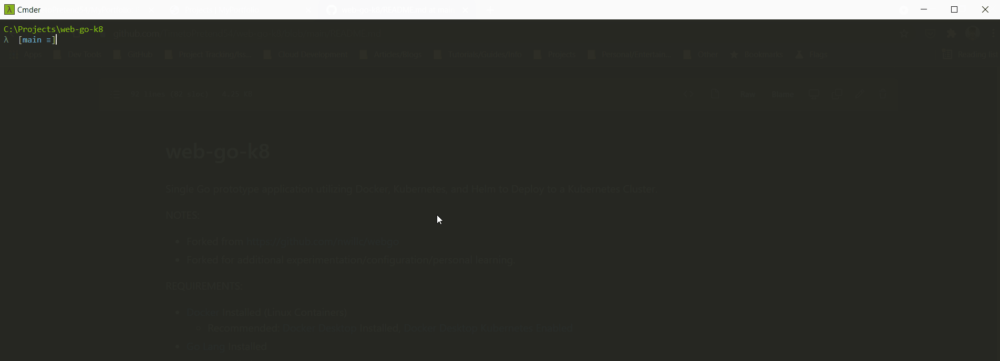
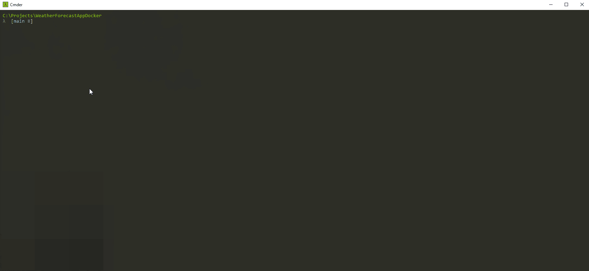
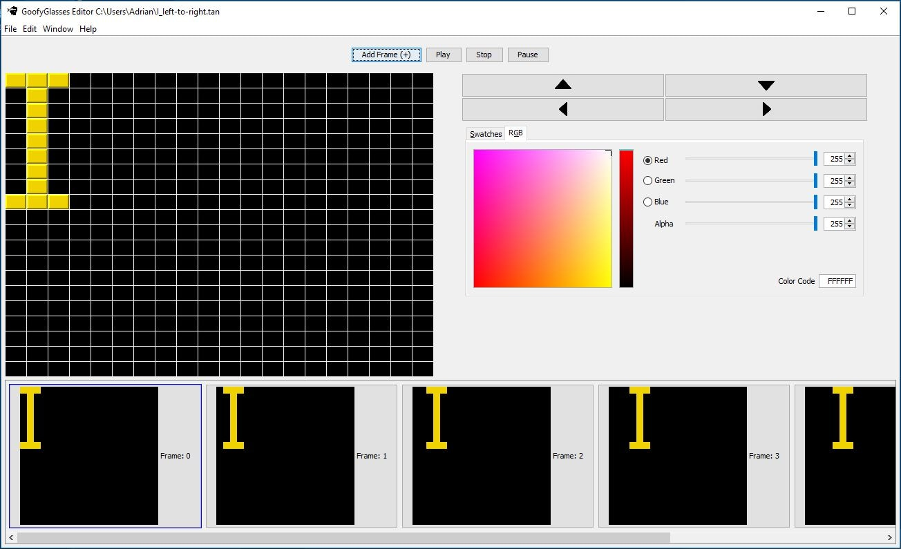

# Personal Projects 

## Kubernetes & Helm - Golang Web App

     
    <i><a href="../../assets/projects/PersonalProjects/WebGoK8/WebGoK8.gif">view full size</a></i>

**Description:** Simple Go prototype application utilizing Docker, Kubernetes, and Helm to Deploy to a Kubernetes Cluster.

**Links:** [Project Repo](https://github.com/TimetoPretend54/web-go-k8)

## ROS & Alexa - Baxter the Robot Making Coffee using OpenCV w/ Alexa Interface

     
    <i><a href="../../assets/projects/PersonalProjects/BaxterAlexaProject/AlexaBaxterCoffeeFinal.gif">view full size</a></i>

**Description:** University project revolving around having [Baxter the Robot](https://en.wikipedia.org/wiki/Baxter_%28robot%29) make a cup of coffee. Utilizing [ROS (Robot Operating System)](https://en.wikipedia.org/wiki/Robot_Operating_System) to help w/ 3D mapping, navigation, and real-time vision (OpenCV: Real-Time Computer Vision).

Alexa was for the desire of bidirectional communication between a custom [Alexa Skill](https://www.amazon.com/alexa-skills/b?node=13727921011) and the ROS Node for communicating with Baxter. [PubNub](https://www.pubnub.com/docs/sdks/python/) was used for the Pub/Sub Paradigm. 

**Links:** [Project Code](https://github.com/TimetoPretend54/MyPortfolio/tree/main/assets/projects/PersonalProjects/BaxterProject/code/Project1-KeruigMachine), [Full Video](https://www.youtube.com/watch?v=kO5B5dSil9A)

## Docker Compose - NET/Angular Weather Forecast App

     
    <i><a href="../../assets/projects/PersonalProjects/WeatherForecast/WeatherForecast.gif">view full size</a></i>

**Description:** WeatherForecast prototype application utilizing .NET Core, Angular, SQL Server, containerized by utilizing Docker Containers (DockerCompose.yml & Dockerfile).

**Links:** [Project Repo](https://github.com/TimetoPretend54/WeatherForecastAppDocker)

## Java libGDX - Phantom Lord Video Game

     
    <i><a href="../../assets/projects/PersonalProjects/PhantomLordGameProject/PhantomLord.gif">view full size</a></i>

**Description:** This project was for a short retro-style side scroller video game. The game is written in Java and uses the [libGDX framework](https://libgdx.com/). All Music, Sounds, Art, Environments from freesounds.org and opengameart.org, powered using libGDX.

**Links:** [Project Code](https://github.com/TimetoPretend54/MyPortfolio/tree/main/assets/projects/PersonalProjects/PhantomLordGameProject/code), [Full Video](https://www.youtube.com/watch?v=1VASgMhx6Ww)

## Custom PCB & Arduino Development - Wireless Tower of Lights

     
    <i><a href="../../assets/projects/PersonalProjects/WirlessTowerOfLightsProject/UoITowerOfLights.gif">view full size</a></i>

**Description:** The Wireless Tower of Lights at the University of Idaho was a project to convert the show's electronics to a fully wireless system. The new system involved the development of microprocessor based wireless modules that would are attached to each of the light bars

**Links:** [Project Wiki](http://mindworks.shoutwiki.com/wiki/Wireless_Tower_of_Lights), [Project Repo](https://github.com/YupHio/LEaD_Design)

## Python Raspberry Pi - Turing Machine Simulator

     
    <i><a href="../../assets/projects/PersonalProjects/TuringMachineSimulatorProject/TurringMachineSimulator.gif">view full size</a></i>

**Description:** Software simulator that multiplies two numbers and displays the result in the form of a [turing machine](https://en.wikipedia.org/wiki/Turing_machine). The program was written in Python, using a Raspberry Pi with a Grove Connector Interface Board that connects to a I2C 4 Channel Mux Extender Board

**Links:** [Project Code](https://github.com/TimetoPretend54/MyPortfolio/tree/main/assets/projects/PersonalProjects/TuringMachineSimulatorProject/code), [Full Video](https://www.youtube.com/watch?v=8JhakxZcqdM)

## Java Animation Editor - GoofyGlasses

    

**Description:** Java Animation Editor for creating short animations to export to low-level arduino boards that would play said animation.

**Links:** [Project Repo](https://github.com/GoofyGlasses-CS383-S17)

## Distributed Program that uses MPI - 2D Heat Distribution Program

**Description:** Software created to solve the partial differential equation 2D Heat Distribution Problem utilizing the [Chebyshev-Accelerated Jacobi Iteration Algorithm](https://en.wikipedia.org/wiki/Chebyshev_iteration). Writtien in C. (MPI = Messaging Programming Interface)

**Links:** [Project Code](https://github.com/TimetoPretend54/MyPortfolio/tree/main/assets/projects/PersonalProjects/2DHeatDistProject)
