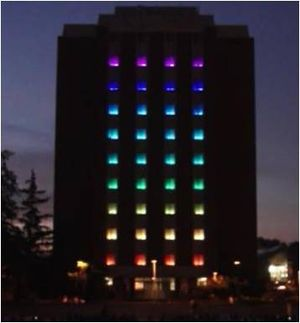

# Projects

## Docker - NET/Angular Weather Forecast App

WeatherForecast prototype application utilizing .NET Core, Angular, SQL Server, containerized by utilizing Docker Containers (DockerCompose.yml & Dockerfile).

💡 See [WeatherForecastAppDocker Repo ](https://github.com/TimetoPretend54/WeatherForecastAppDocker)

## ROS - Baxter the Robot Making Coffee using OpenCV (Real-Time Computer Vision)

University project revolving around having [Baxter the Robot](https://en.wikipedia.org/wiki/Baxter_%28robot%29) make a cup of coffee. Utilizing [ROS (Robot Operating System)](https://en.wikipedia.org/wiki/Robot_Operating_System) to help w/ 3D mapping, navigation, and real-time vision. 

💡 See [Project Code Here](https://github.com/TimetoPretend54/MyPortfolio/tree/main/assets/projects/BaxterProject/code/Project1-KeruigMachine)

*Baxter Youtube Video*

## AWS Alexa - Alexa Interface w/ Baxter the Robot

Continuation of the University project revolving around having [Baxter the Robot](https://en.wikipedia.org/wiki/Baxter_%28robot%29) make a cup of coffee.

The goal was for bidirectional communication between a custom [Alexa Skill](https://www.amazon.com/alexa-skills/b?node=13727921011) and the ROS Node for communicating with Baxter. [PubNub](https://www.pubnub.com/docs/sdks/python/) was used for the Pub/Sub Paradigm. 

💡 See [Project Code Here](https://github.com/TimetoPretend54/MyPortfolio/tree/main/assets/projects/BaxterAlexaProject)

*Baxter Youtube Video*

## Java libGDX - Phantom Lord Video Game

This project was for a short retro-style side scroller video game. The game is written in Java and uses the [libGDX framework](https://libgdx.com/). All Music, Sounds, Art, Environments from freesounds.org and opengameart.org, powered using libGDX.

💡 See [Project Code Here](https://github.com/TimetoPretend54/MyPortfolio/tree/main/assets/projects/PhantomLordGameProject/code)

<!-- https://handsontek.net/get-youtube-thumbnail-images/ -->

*Phantom Lord Playthrough Youtube Video*

## Java Animation Editor - GoofyGlasses

Java Animation Editor for creating short animations to export to low-level arduino boards that would play said animation.

💡 See [GoofyGlasses Repo](https://github.com/GoofyGlasses-CS383-S17)

## Custom PCB & Arduino Development - Wireless Tower of Lights

The Wireless Tower of Lights at the University of Idaho was a project to convert the show's electronics to a fully wireless system. The new system involved the development of microprocessor based wireless modules that would are attached to each of the light bars

[Wireless Tower of Lights Wiki](http://mindworks.shoutwiki.com/wiki/Wireless_Tower_of_Lights)

💡 See [Wireless Tower of Lights Repo](https://github.com/YupHio/LEaD_Design)

## Python Raspberry Pi - Turing Machine Simulator

Software simulator that multiplies two numbers and displays the result in the form of a [turing machine](https://en.wikipedia.org/wiki/Turing_machine). The program was written in Python, using a Raspberry Pi with a Grove Connector Interface Board that connects to a I2C 4 Channel Mux Extender Board

💡 See [Project Code Here](https://github.com/TimetoPretend54/MyPortfolio/tree/main/assets/projects/TuringMachineSimulatorProject/code)

<!-- https://handsontek.net/get-youtube-thumbnail-images/ -->

*Turing Machine Simulator Youtube Video*

## Distributed Program that uses MPI - 2D Heat Distribution Program

Software created to solve the partial differential equation 2D Heat Distribution Problem utilizing the [Chebyshev-Accelerated Jacobi Iteration Algorithm](https://en.wikipedia.org/wiki/Chebyshev_iteration). Writtien in C. (MPI = Messaging Programming Interface)

💡 See [Project Code Here](https://github.com/TimetoPretend54/MyPortfolio/tree/main/assets/projects/2DHeatDistProject)
