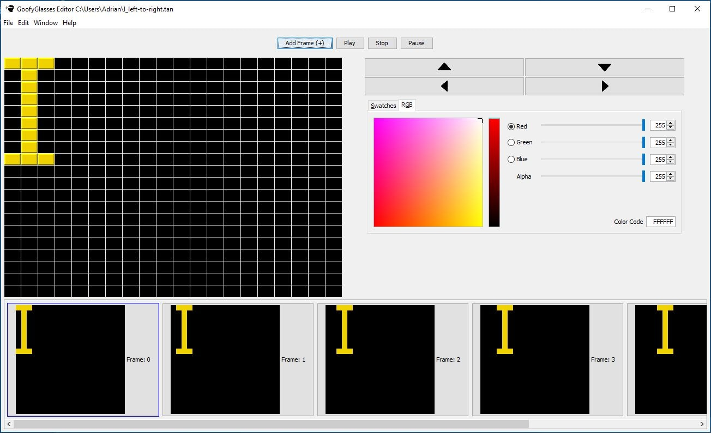

# Projects

## Docker - NET/Angular Weather Forecast App

WeatherForecast prototype application utilizing .NET Core, Angular, SQL Server, containerized by utilizing Docker Containers (DockerCompose.yml & Dockerfile).

💡 See [WeatherForecastAppDocker Repo ](https://github.com/TimetoPretend54/WeatherForecastAppDocker)

## ROS - Baxter the Robot Making Coffee using OpenCV (Real-Time Computer Vision)

University project revolving around having [Baxter the Robot](https://en.wikipedia.org/wiki/Baxter_%28robot%29) make a cup of coffee. Utilizing [ROS (Robot Operating System)](https://en.wikipedia.org/wiki/Robot_Operating_System) to help w/ 3D mapping, navigation, and real-time vision. 

💡 See [Project Code Here](https://github.com/TimetoPretend54/MyPortfolio/tree/main/assets/projects/BaxterProject/code/Project1-KeruigMachine)

*Baxter Youtube Video*

## AWS Alexa - Alexa Interface w/ Baxter the Robot

Continuation of the University project revolving around having [Baxter the Robot](https://en.wikipedia.org/wiki/Baxter_%28robot%29) make a cup of coffee.

The goal was for bidirectional communication between a custom [Alexa Skill](https://www.amazon.com/alexa-skills/b?node=13727921011) and the ROS Node for communicating with Baxter. [PubNub](https://www.pubnub.com/docs/sdks/python/) was used for the Pub/Sub Paradigm. 

💡 See [Project Code Here](https://github.com/TimetoPretend54/MyPortfolio/tree/main/assets/projects/BaxterAlexaProject)

*Baxter Youtube Video*

## GoofyGlasses - Animation Creation Editor

Java Animation Editor for creating short animations to export to low-level arduino boards that would play said animation.

💡 See [GoofyGlasses Repo](https://github.com/GoofyGlasses-CS383-S17)